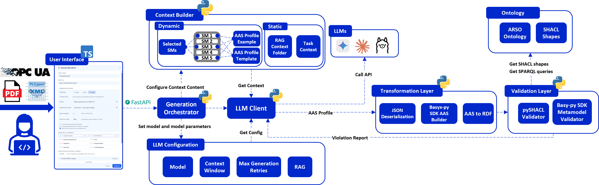

# ARSO Ontology AAS Generation

Ontology-grounded generation, transformation, and validation of Asset Administration Shells (AAS) using Large Language Models (LLMs), RDF projection, SHACL validation, and human-in-the-loop correction.

This repository contains the implementation of a modular framework for generating AAS instances from technical equipment documentation. The framework is centred around the **AAS Resource Structure Ontology (ARSO)**, which provides semantic grounding for LLM-based generation and formal validation through SHACL constraints.

---

## Project Overview

Creating high-quality and interoperable Asset Administration Shells is a manual and knowledge-intensive task. Engineers need to understand the AAS metamodel, relevant IDTA submodel templates, equipment documentation, communication interfaces, and domain-specific modelling conventions.

This project explores how LLMs can support this process when combined with ontology-based grounding and validation. Instead of asking an LLM to generate a complete AAS JSON document directly, the framework generates a compact **AAS profile** containing the asset-specific information. This profile is then normalised, transformed into a full AAS JSON structure, projected to RDF, and validated against ontology-derived SHACL constraints.

The framework consists of three main layers, plus a FastAPI backend and a React/TypeScript editor built on top of them:

1. **Generation** (`Generation/`)
   - Builds the LLM context from user input, selected submodels, source documents, examples, and ontology-derived guidance.
   - Calls the configured LLM provider (any OpenAI-compatible endpoint, Gemini, or Claude).
   - Produces a compact AAS profile, retrying with structured feedback when validation fails.

2. **Transformation** (`Transformation/`)
   - Normalises the generated profile.
   - Expands the profile into a full AAS JSON representation via dedicated per-submodel builder classes.
   - Converts the generated AAS into RDF for validation (`AAS_to_RDF/`), and can invert a full AAS back into a profile (`AAS_Builder/AAS_to_Profile/`) — the same code path the UI uses to import an existing AAS for editing.

3. **Validation** (`Validation/`)
   - Validates the RDF representation against SHACL constraints derived from ARSO and the AAS ontology.
   - Produces structured, per-field validation results.
   - Supports iterative feedback to the LLM and live validation in the editor.

4. **API + UI** (`api/`, `ui/`)
   - A FastAPI backend exposes generation, validation, and profile↔AAS conversion as HTTP endpoints — the single place that knows how to turn a profile into an AAS and back, used by both the LLM pipeline and the editor.
   - A React/TypeScript canvas editor (`ui/`) lets a human author, inspect, and correct AAS profiles directly, with live SHACL validation as you type.

The framework also includes testing material for both SHACL validation (`Testing/SHACL_Tests/`) and LLM-based AAS generation (`Testing/Generation_Tests/`).

---

## Architecture

The framework is designed to keep the LLM task focused and controllable. The LLM generates only the information that must be authored explicitly, while the deterministic transformation layer handles the full AAS structure, semantic identifiers, and serialisation.

This reduces the risk of malformed AAS JSON and makes the generated output easier to validate, correct, and extend.



---

## Demonstration Video

[Ontology_grounded_AAS_gen_720p.webm](https://github.com/user-attachments/assets/57838bc5-169b-48e5-b690-b0683bc1d920)


## Repository Structure

```text
.
├── README.md
├── requirements.txt            # Python dependencies
├── Dockerfile, docker-compose.yml, .dockerignore   # Backend container
│
├── api/                        # FastAPI backend
│   ├── main.py                 # App entry point (uvicorn api.main:app)
│   └── routers/                # /api/generate-aas, /validate, /profile-to-aas, /aas-to-profile
│
├── Generation/                 # LLM-based AAS profile generation
│   ├── pipeline.py             # Main generation pipeline (LLM call + retry-on-violation loop)
│   ├── config.py               # Config dataclass + config.yaml loader
│   ├── config.yaml             # Local config: provider, API keys, models (gitignored, you create this)
│   ├── Context_Builder/        # Prompt/context construction, PDF parsing, RAG
│   └── LLM_Client/             # Provider-agnostic LLM client (any OpenAI-compatible endpoint, Gemini, Claude)
│
├── Ontology/                   # Semantic grounding and validation models
│   ├── AAS/                    # RDF projection of the AAS metamodel
│   ├── ARSO/                   # AAS Resource Structure Ontology (per-submodel modules)
│   ├── CSS/                    # Capability-Skill-Service ontology
│   └── SHACL/                  # Manual + generated SHACL constraints, owl2shacl ruleset
│
├── Transformation/             # AAS construction and RDF projection
│   ├── AAS_Builder/
│   │   ├── AAS_generation/     # Profile → full AAS JSON (per-submodel builder classes)
│   │   └── AAS_to_Profile/     # Full AAS JSON → profile (inverse of the above)
│   ├── AAS_to_RDF/             # AAS JSON → RDF/Turtle, ontology-annotation-driven typing
│   └── Generate_Shapes/        # Regenerates Ontology/SHACL/Generated/ from the ontology modules
│
├── Validation/
│   └── Validator/              # run_shacl(): the single validation entry point used everywhere
│
├── Guidance/                   # Ontology-derived inline authoring hints (used by the editor + auto-fixes)
│
├── Testing/
│   ├── SHACL_Tests/            # SHACL conformance fixtures + runners (see Validation & Testing below)
│   └── Generation_Tests/       # LLM generation evaluation harness (equipment fixtures, metrics, matrix sweeps)
│
└── ui/                         # Interactive AAS editor frontend (React + TypeScript + Vite)
    ├── src/                    # Application source
    ├── Dockerfile, .dockerignore
    └── README.md               # UI-specific documentation
```

---

## Getting Started

### Prerequisites

- Python 3.11+
- Node.js 20+ (only if running the UI outside Docker)
- Docker Desktop (only if using the Docker workflow)
- An API key for at least one LLM provider (see [Configuration](#configuration))

### Option A — Docker (recommended)

Runs the backend (FastAPI + uvicorn, hot-reload) and frontend (Vite dev server, hot-reload) together, with the whole repo bind-mounted so code, ontology, and SHACL changes are picked up without a rebuild.

1. Create `Generation/config.yaml` first (see [Configuration](#configuration) below) — it's gitignored and only ever reaches the container via the bind mount, never baked into the image.
2. From the repo root:

   ```bash
   docker compose up
   ```

3. Backend: [http://localhost:8000](http://localhost:8000) (health check at `/health`) · Frontend: [http://localhost:5173](http://localhost:5173)

Notes:
- Rebuild after changing `requirements.txt` or `ui/package.json`: `docker compose build`.
- The frontend container uses an anonymous volume for `node_modules` so the host bind mount doesn't shadow the image's own (Linux-native) install with your host's `node_modules` — you don't need `node_modules` installed locally for this path at all.
- Inside the containers, the frontend reaches the backend at `http://backend:8000` (see `VITE_API_PROXY_TARGET` in `docker-compose.yml`), not `localhost`.
- Stop with `docker compose down`; add `-v` only if you intentionally want to drop the anonymous `node_modules` volume too.

### Option B — Native setup

```bash
git clone https://github.com/MartinJensen37/ARSO_Ontology_AAS_Generation.git
cd ARSO_Ontology_AAS_Generation
python -m venv .venv
```

Activate the virtual environment:

```bash
# Windows
.venv\Scripts\activate
# Linux/macOS
source .venv/bin/activate
```

Install dependencies and set up config:

```bash
pip install -r requirements.txt
```

Create `Generation/config.yaml` (see [Configuration](#configuration)).

Run the backend:

```bash
uvicorn api.main:app --reload --port 8000
```

Run the frontend (separate terminal):

```bash
cd ui
npm install
npm run dev
```

The frontend proxies `/api/*` to `http://localhost:8000` in dev mode (`ui/vite.config.ts`) — no separate configuration needed. See `ui/README.md` for frontend-specific detail.

---

## Configuration

The generation pipeline reads `Generation/config.yaml`, which is gitignored (it holds API keys) — create it yourself. Minimal example using a single OpenAI-compatible provider:

```yaml
provider: deepseek   # or: gemini, claude, groq, openrouter, or any provider listed in
                      # Generation/LLM_Client/llm_client.py's OPENAI_COMPATIBLE_BASE_URLS

api_keys:
  deepseek: "YOUR_API_KEY_HERE"
  # google_ai_studio: "..."   # used when provider: gemini
  # anthropic: "..."          # used when provider: claude (optional — Claude Code CLI can use its own session)
  # groq: "..."
  # openrouter: "..."

models:
  deepseek:
    - "deepseek-chat"

asset:
  name: "UnknownAsset"
  base_url: "https://smartproductionlab.aau.dk"
  # pdf_path: "path/to/datasheet.pdf"   # optional; the UI/API also accept PDFs uploaded at request time

submodels:
  - Nameplate
  - HierarchicalStructures
  - AID
  - Skills
  - Capabilities
  - OperationalData

options:
  generation_mode: "json-description"   # "json" | "json-description"
  use_rag: false
  use_example: false
  force_full_aas_output: false
  max_attempts: 2
```

Adding a new OpenAI-compatible provider needs only a `base_url` entry in `OPENAI_COMPATIBLE_BASE_URLS` (`Generation/LLM_Client/llm_client.py`) plus the corresponding `api_keys`/`models` section above — no other code changes.

`paths.shacl_shapes` / `paths.ontologies` can override the default SHACL shapes and ontology files used for validation, but the defaults (`Ontology/SHACL/Generated/shapes.generated.shacl.ttl` + `Ontology/SHACL/Manual/arso-rules.shacl.ttl`) are almost always what you want.

---

## Usage

**Editor (recommended for interactive work):** open the frontend, build or import a profile on the canvas, and validation runs live as you edit. Use "Generate with AI" to draft submodels from an uploaded datasheet.

**API directly:**

```bash
# Generate an AAS from a PDF + selected submodels (streams progress via SSE)
curl -N -X POST http://localhost:8000/api/generate-aas \
  -H "Content-Type: application/json" \
  -d '{"asset_name": "MyAsset", "selected_submodels": ["Nameplate", "AID"], ...}'

# Validate a full AAS JSON document
curl -X POST http://localhost:8000/api/validate \
  -H "Content-Type: application/json" \
  -d '{"aas_json_text": "..."}'

# Build a profile into a full AAS + validate in one round trip
curl -X POST http://localhost:8000/api/profile-to-aas \
  -H "Content-Type: application/json" \
  -d '{"asset_name": "MyAsset", "selected_submodels": ["Nameplate"], "profile": {...}}'

# Invert a full AAS JSON back into a profile (what the editor's "import" uses)
curl -X POST http://localhost:8000/api/aas-to-profile \
  -H "Content-Type: application/json" \
  -d '{"aas_json_text": "..."}'
```

See `api/routers/*.py` for the exact request/response models, or the interactive docs at `http://localhost:8000/docs` while the backend is running.

---

## Validation & Testing

### Validating a single AAS JSON file

```bash
python Testing/SHACL_Tests/Test_Scripts/validate_aas.py path/to/your.aas.json
```

This is a thin wrapper around `Validation.Validator.validator.run_shacl` — the same function the API's `/api/validate` endpoint and the generation pipeline's retry loop use, so it always checks against the exact same shapes the rest of the system enforces.

### SHACL regression suite

`Testing/SHACL_Tests/Test_Cases/` holds a set of deliberately-broken `invalid_*.aas.json` fixtures, each exercising one specific SHACL shape (missing nameplate, a Skill referencing a nonexistent AID action, an empty AID interface, etc.). Run all of them at once:

```bash
python Testing/SHACL_Tests/Test_Scripts/run_test_cases.py
```

Every fixture is expected to fail validation; the script exits non-zero if any of them unexpectedly conforms (a sign a shape was accidentally weakened).

### Regenerating SHACL shapes from the ontology

`Ontology/SHACL/Generated/shapes.generated.shacl.ttl` is derived from the OWL restrictions in the `Ontology/ARSO/Modules/*.ttl` files via an owl2shacl ruleset:

```bash
python Transformation/Generate_Shapes/generate_shapes.py
```

> **Known issue:** this generator has a pre-existing performance problem (a `pyparsing`/SPARQL parsing bottleneck in the owl2shacl ruleset) that can make it impractically slow for some ontology changes. If a run hangs, the shapes file has been hand-patched directly before to work around this — diff the specific shape you changed against the ontology restriction it corresponds to rather than waiting on a full regeneration.

### LLM generation evaluation harness

`Testing/Generation_Tests/` runs the full generation pipeline against real equipment fixtures (a datasheet PDF + interface spec + a **ground-truth profile**) and scores the result.

Each equipment directory (`Testing/Generation_Tests/equipment/<equipment_id>/`) has an `equipment.yaml` (asset name, protocol, selected submodels, source documents) and a `ground_truth.yaml`. The ground truth is a real AAS **profile** — the same shape `profile_document_to_aas_json` consumes — plus a short `required_paths`/`must_not_contain` scoring-hints block for the few things a profile can't express on its own (which fields are hard requirements vs. nice-to-have, and forbidden cross-contamination terms). The harness builds that profile into a genuine reference AAS via the real pipeline and scores the generated AAS by diffing it against that reference by semanticId/path — ground truth can't drift from what the pipeline actually produces, because it's built by the same pipeline.

Run one experiment:

```bash
python -m Testing.Generation_Tests.Test_Scripts.run_eval \
  --equipment filling_module --provider claude --model claude-sonnet-4-6 \
  --run-id my-test-run
```

Run a full matrix sweep (equipment × provider/model configs, see `Testing/Generation_Tests/Test_Matrix/matrix.yaml`):

```bash
python -m Testing.Generation_Tests.Test_Scripts.run_eval \
  --matrix Testing/Generation_Tests/Test_Matrix/matrix.yaml --run-id my-sweep
```

Results land in `Testing/Generation_Tests/results/<run-id>/` — `results.jsonl` (one row per experiment: coverage, cross-reference correctness, SHACL conformance, verify-marker rate, cost estimate) plus a per-experiment subfolder with the full prompt, raw LLM output, generated AAS, reference AAS, and SHACL report for anything that looks wrong. `aggregate.py` and `plot_results.py` summarise a run's `results.jsonl`.

---

## Ontology

`Ontology/ARSO/Modules/` holds one `.ttl` file per submodel (`nameplate.ttl`, `aid.ttl`, `control-component.ttl` for Skills, `capabilities.ttl`, `hierarchical-structures.ttl`, `operational-data.ttl`, `parameters.ttl`, ...). Each class declares how it's identified in an AAS JSON document via `arso:semanticId` / `arso:idShort` / `arso:parentClass` / `arso:transitiveParentClass` annotations — both `Transformation/AAS_to_RDF/aas_to_rdf.py` (AAS → RDF) and the SHACL shape generator read these directly, so extending an existing submodel with a new element that follows this convention needs no Python changes.

Mandatory-field and structural constraints are expressed as OWL restrictions (`owl:someValuesFrom`, `owl:qualifiedCardinality`, `owl:oneOf` enums) directly on these classes, and converted to SHACL shapes by the owl2shacl generator (see [Regenerating SHACL shapes](#regenerating-shacl-shapes-from-the-ontology) above). A small set of constraints that need graph traversal beyond a single class (cross-submodel reference targets, e.g. "a Skill's InterfaceReference must resolve to a real AID action") are hand-written as SPARQL-based SHACL rules in `Ontology/SHACL/Manual/arso-rules.shacl.ttl` instead.

---

## Acknowledgements

This work was supported by **Novo Nordisk AMSAT**.

---

## Licence

This project is licensed under the MIT License.
